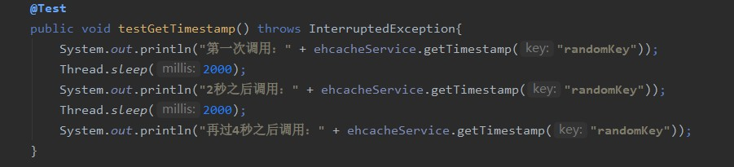

# Ehcache 简介
ehcache是一个纯java的进程内缓存框架，是Hibernate中默认的CacheProvider，主要面向
通用缓存，Java EE和轻量级容器。
具有以下特点：
- 内存和磁盘存储
- 缓存加载、缓存扩展、缓存异常处理
- 支持REST和SOAP api

Ehcache与Redis的比较
- Ehcache的性能比Redis好，因为ehcache是直接操作虚拟机中的缓存
- Ehcache虽然提供缓存共享方案，但是redis的缓存共享方案和集群处理方案更加程树
> 综上，如果是单体应用，对缓存的性能要求比较高的情况下，选用ehcache；如果是分布式应用
> 推荐使用redis

## Ehcache注解使用说明
- `@Cacheable`：标识所注解的方法是可以缓存的，调用该方法获取的结果会被缓存，下次调用时，直接返回缓存中的结果
> 该注解可以使用`@Condition`注解来设置判断条件，满足条件的才使用缓存
- `@CachePut`：标识更新缓存结果
- `@CacheEvict`：标识删除相应的缓存

# 单机下使用Ehcache
使用步骤
1. 引入`ehcahce`jar包
```xml
        <dependency>
            <groupId>net.sf.ehcache</groupId>
            <artifactId>ehcache</artifactId>
        </dependency>
```
2. 定义ehcache.xml文件
    1. 定义默认缓存块
    ```xml
    <defaultCache
            maxEntriesLocalHeap="10000"
            eternal="false"
            timeToIdleSeconds="120"
            timeToLiveSeconds="120"
            maxEntriesLocalDisk="10000000"
            diskExpiryThreadIntervalSeconds="120"
            memoryStoreEvictionPolicy="LRU">
        <persistence strategy="localTempSwap"/>
    </defaultCache>
    ```
    2. 定义自定义缓存块
    ```xml
    <cache name="HelloWorldCache"
           maxElementsInMemory="1000"
           eternal="false"
           timeToIdleSeconds="5"
           timeToLiveSeconds="5"
           overflowToDisk="false"
           memoryStoreEvictionPolicy="LRU"/>
    ```
3. 定义类文件使用
```java
@RunWith(SpringJUnit4ClassRunner.class)
public class CacheTest {
    @Test
    public void cacheTest() {
        //1.创建缓存管理器
        CacheManager cacheManager = CacheManager.create("src/main/resources/ehcache.xml");
        //2.获取缓存对象
        Cache cache = cacheManager.getCache("HelloWorldCache");
        //3.创建元素
        Element element = new Element("key1", "val1");
        //4.将元素添加到缓存
        cache.put(element);
        //5.获取缓存
        Element e = cache.get("key1");
        System.out.println("element: " + e.toString());
        System.out.println("element1 val: " + e.getObjectValue());
        //6.删除元素
        cache.remove("key1");
        Dog dog = new Dog("little dog", "black", 2);
        Element e2 = new Element("dog", dog);
        cache.put(e2);
        Element element2 = cache.get("dog");
        Dog d= (Dog) element2.getObjectValue();
        System.out.println(d.toString());
        System.out.println(cache.getSize());
        //7.刷新缓存
        cache.flush();
        //8.关闭缓存管理器
        cacheManager.shutdown();
    }
}
```
>总结：首先定义缓存管理器CacheManager，定义缓存块策略Cache,通过缓存块使用缓存

# spring集成Ehcache
1. 引入spring-boot-starter-cache依赖
    ```xml
            <dependency>
                <groupId>org.springframework.boot</groupId>
                <artifactId>spring-boot-starter-cache</artifactId>
            </dependency>
    ```
2. 启动类声明开启缓存
    ```java
    @SpringBootApplication
    @EnableCaching
    public class CacheApplication {
        public static void main(String[] args) {
            SpringApplication.run(CacheApplication.class, args);
        }
    }
    ```
3. 方法中通过注解声明使用的cacheName（配置文件ehcache.xml中声明）
    ```java
    @Service
    @Slf4j
    public class EhcacheServiceImpl implements EhcacheService {
    
        @Override
        @Cacheable(value = "cache-01", key = "#key")
        public String getTimestamp(String key) {
            Long timestamp = System.currentTimeMillis();
            return timestamp.toString();
        }
    
        @Override
        @Cacheable(value = "cache-01", key = "'timestamp:' + #key")
        public String cacheWithPrefix(String key) {
            Long timestamp = System.currentTimeMillis();
            return "timestamp:"+timestamp;
        }
    
        @Override
        @CachePut(value = "cache-01", key = "#key")
        public String updateTimeStamp(String key) {
            Long timestamp = System.currentTimeMillis();
            log.info("update timestamp {}",timestamp);
            return timestamp.toString();
        }
    
    
    
        @Override
        @Cacheable(value = "cache-01", condition = "#key.length()<12")
        public boolean cacheWithCondition(String key) {
            System.out.println("UserCache:" + key);
            return false;
        }
    
        @Override
        @CacheEvict(value = "cache-01", key = "#key")
        public void removeCacheByKey(String key) {
            System.out.println("cache-01 remove:" + key);
        }
    
        @Override
        @CacheEvict(value = "cache-01", allEntries = true)
        public void removeAllCache() {
            System.out.println("cache-01 delete all");
        }
    }
    ```
3. 通过测试类测试调用情况



参考内容：https://www.cnblogs.com/myseries/p/11370109.html